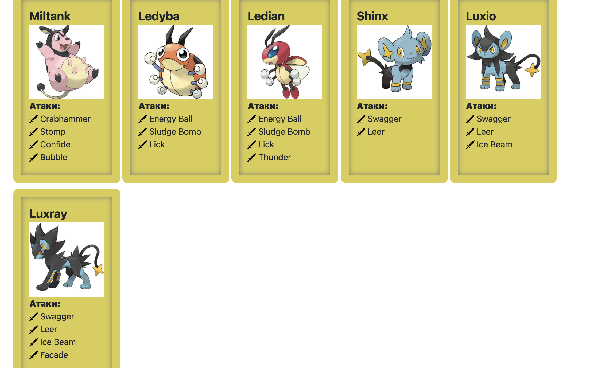
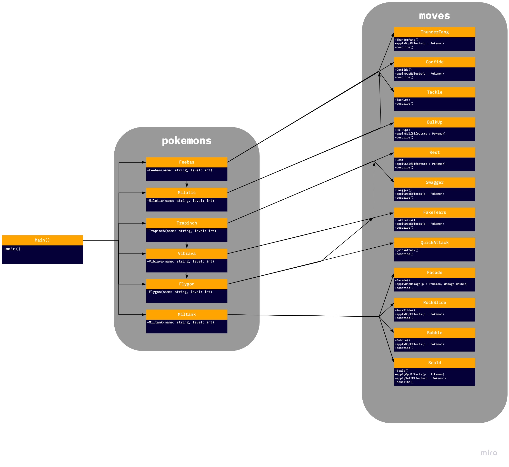

# proga_lab2

### Текст задания
На основе базового класса Pokemon написать свои классы для заданных видов покемонов. Каждый вид покемона должен иметь один или два типа и стандартные базовые характеристики:
1. очки здоровья (HP)
2. атака (attack)
3. защита (defense)
4. специальная атака (special attack)
5. специальная защита (special defense)
6. скорость (speed)

Классы покемонов должны наследоваться в соответствии с цепочкой эволюции покемонов. На основе базовых классов PhysicalMove, SpecialMove и StatusMove реализовать свои классы для заданных видов атак.

Атака должна иметь стандартные тип, силу (power) и точность (accuracy). Должны быть реализованы стандартные эффекты атаки. Назначить каждому виду покемонов атаки в соответствии с вариантом. Уровень покемона выбирается минимально необходимым для всех реализованных атак.

Используя класс симуляции боя Battle, создать 2 команды покемонов (каждый покемон должен иметь имя) и запустить бой.

Базовые классы и симулятор сражения находятся в jar-архиве (обновлен 9.10.2018, исправлен баг с добавлением атак и кодировкой). Документация в формате javadoc - [здесь](https://se.ifmo.ru/~tony/doc/).

Информацию о покемонах, цепочках эволюции и атаках можно найти на сайтах http://poke-universe.ru, http://pokemondb.net, http://veekun.com/dex/pokemon

### Покемоны

### Диаграмма классов


[**Исходный код программы**](src/)

[**Метод main**](src/Main.java)

### Результат выполнения:
```Feebas Дирихле из команды фиолетовых вступает в бой!
Miltank Вейерштрасс из команды зеленых вступает в бой!
Miltank Вейерштрасс using Scald. 
Feebas Дирихле теряет 2 здоровья.
Feebas Дирихле воспламеняется

Feebas Дирихле using Thunder Fang. 
Miltank Вейерштрасс восстанавливает 1 здоровья.

Feebas Дирихле using Tackle. 
Miltank Вейерштрасс восстанавливает 1 здоровья.

Miltank Вейерштрасс using Bubble. 
Feebas Дирихле теряет 1 здоровья.

Feebas Дирихле using Tackle. 
Miltank Вейерштрасс восстанавливает 1 здоровья.

Miltank Вейерштрасс using Rock Slide. 
Feebas Дирихле теряет 4 здоровья.

Feebas Дирихле using Thunder Fang. 
Miltank Вейерштрасс восстанавливает 1 здоровья.

Miltank Вейерштрасс using Scald. 
Feebas Дирихле теряет 3 здоровья.

Feebas Дирихле using Thunder Fang. 
Miltank Вейерштрасс восстанавливает 1 здоровья.
Miltank Вейерштрасс парализован

Miltank Вейерштрасс using Rock Slide. 
Критический удар!
Feebas Дирихле теряет 11 здоровья.
Feebas Дирихле теряет сознание.
Flygon Коши из команды фиолетовых вступает в бой!
Miltank Вейерштрасс using Facade. 
Критический удар!
Flygon Коши теряет 11 здоровья.

Flygon Коши промахивается

Flygon Коши using Quick Attack. 
Miltank Вейерштрасс теряет 3 здоровья.

Miltank Вейерштрасс using Scald. 
Критический удар!
Flygon Коши теряет 13 здоровья.
Flygon Коши воспламеняется
Flygon Коши теряет сознание.
Milotic Лагранж из команды фиолетовых вступает в бой!
Miltank Вейерштрасс using Rock Slide. 
Критический удар!
Milotic Лагранж теряет 9 здоровья.

Milotic Лагранж using Thunder Fang. 
Miltank Вейерштрасс теряет 4 здоровья.

Miltank Вейерштрасс using Facade. 
Критический удар!
Milotic Лагранж теряет 12 здоровья.
Milotic Лагранж теряет сознание.
В команде фиолетовых не осталось покемонов.
Команда зеленых побеждает в этом бою!
